# Assignment 1 Report

## Image 1 Results

### Gaussian Smoothing

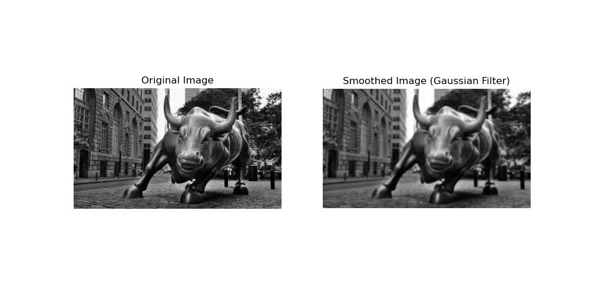

### X and Y Derivatives

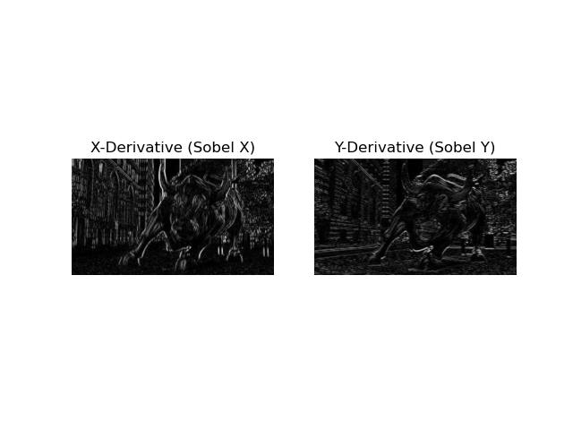

### Gradient Magnitude

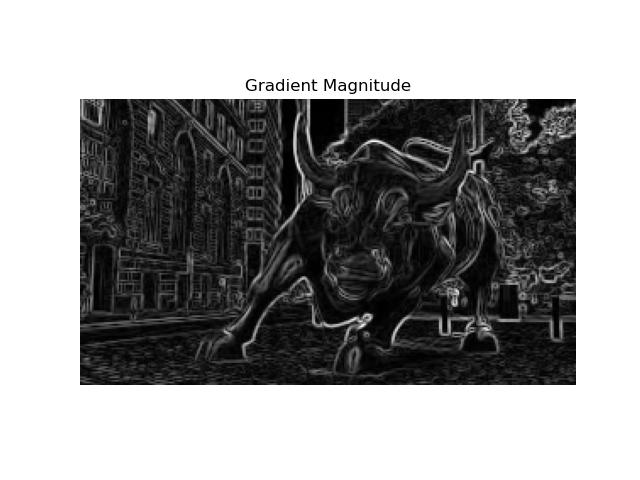

### NMS

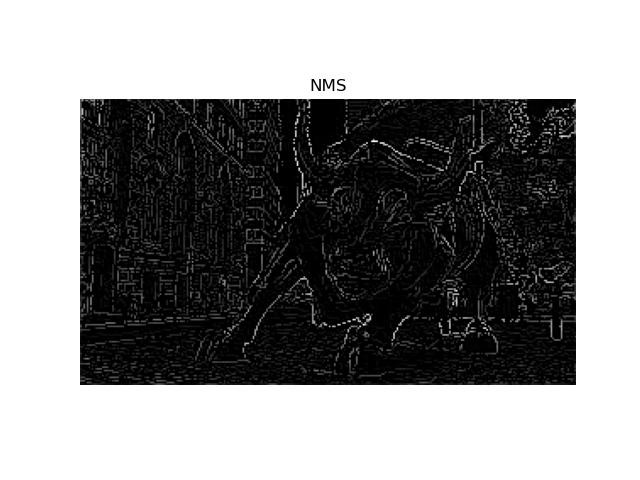

### Hysteris Thresholding

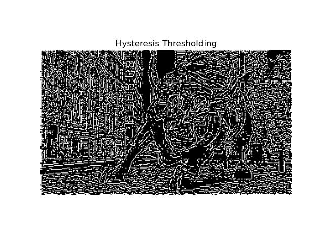

---

## Image 2 Results

### Gaussian Smoothing

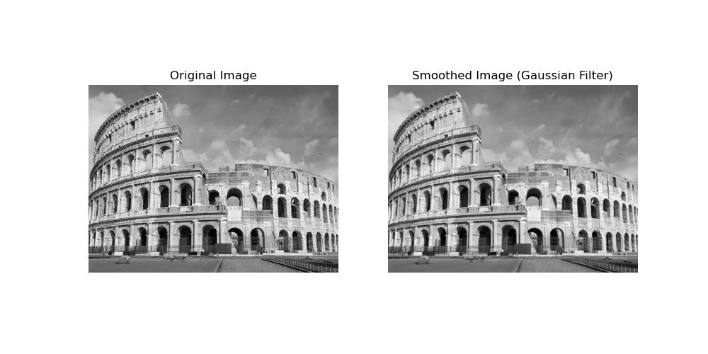

### X and Y Derivatives

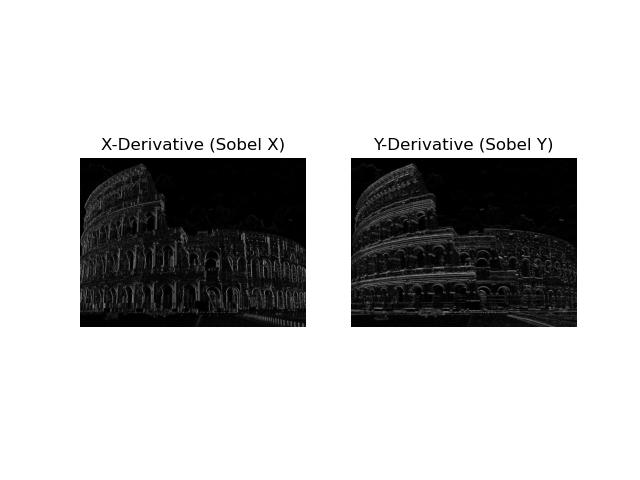

### Gradient Magnitude

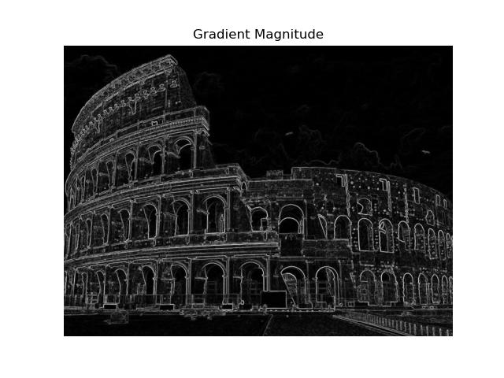

### NMS

### Hysteris Thresholding

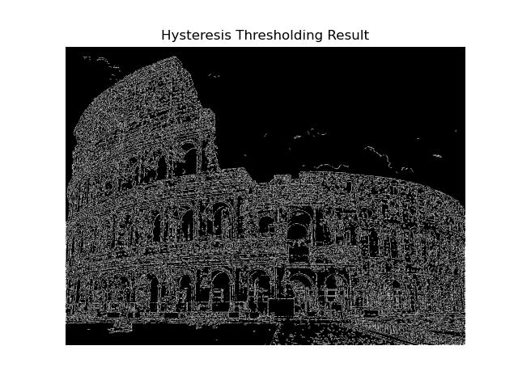

---

## Image 3 Results

### Gaussian Smoothing

### X and Y Derivatives

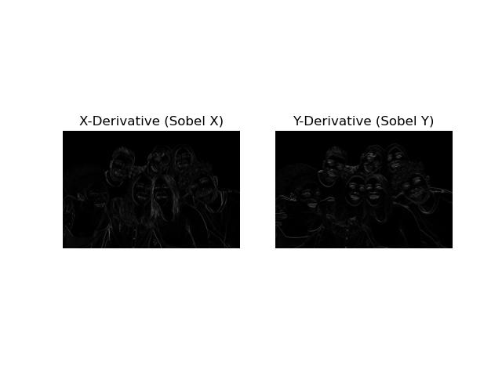

### Gradient Magnitude

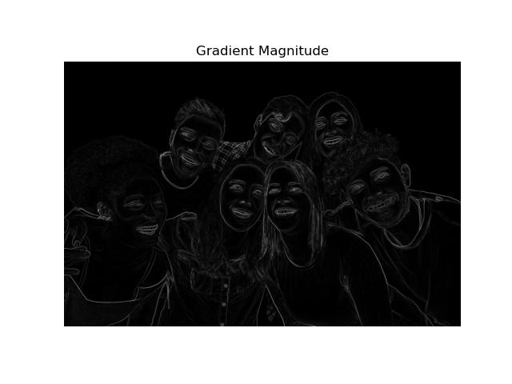

### NMS

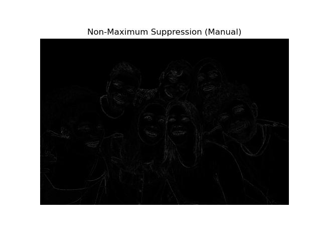

### Hysteris Thresholding

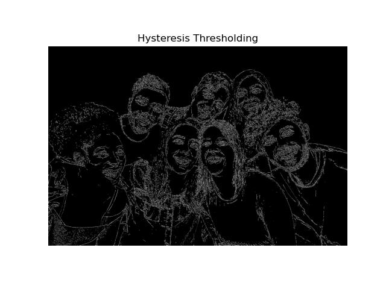

---

## Image 4 Results

### Gaussian Smoothing

### X and Y Derivatives

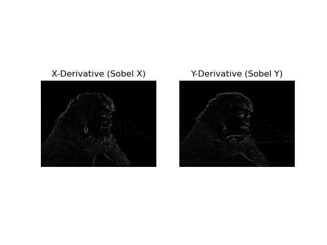

### Gradient Magnitude

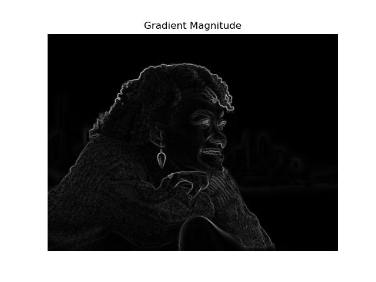

### NMS

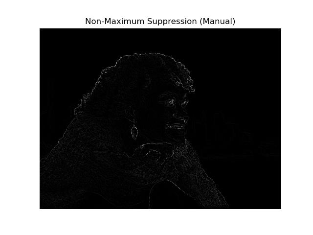

### Hysteris Thresholding

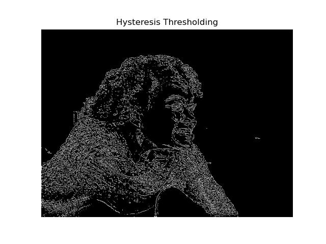

---
## Image 5 Results

### Gaussian Smoothing

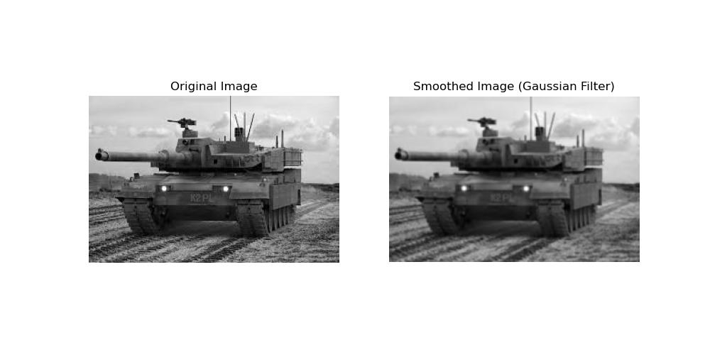

### X and Y Derivatives

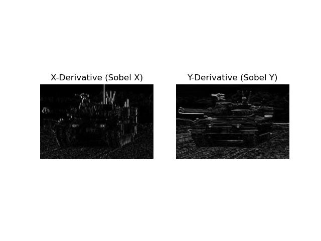

### Gradient Magnitude

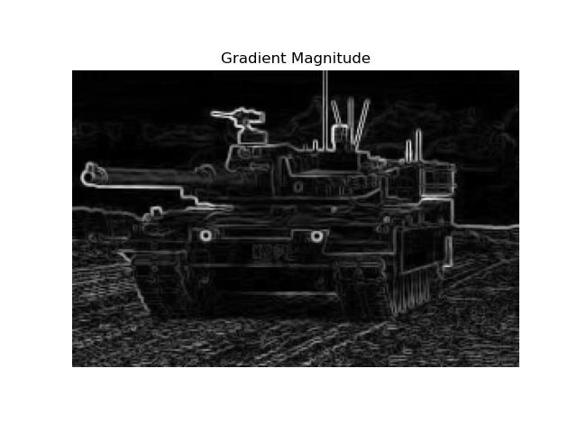

### NMS

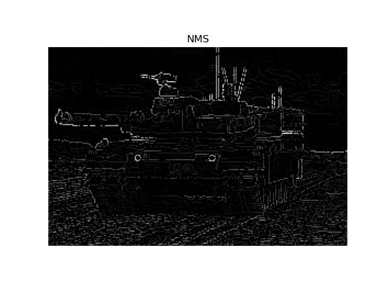

### Hysteris Thresholding

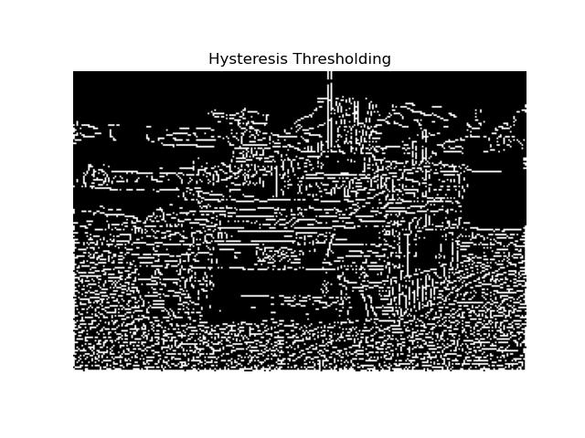