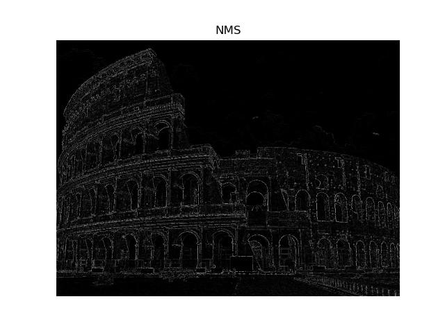
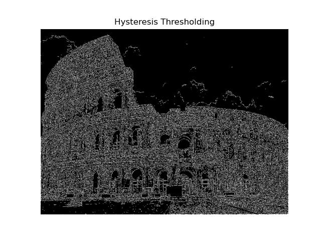
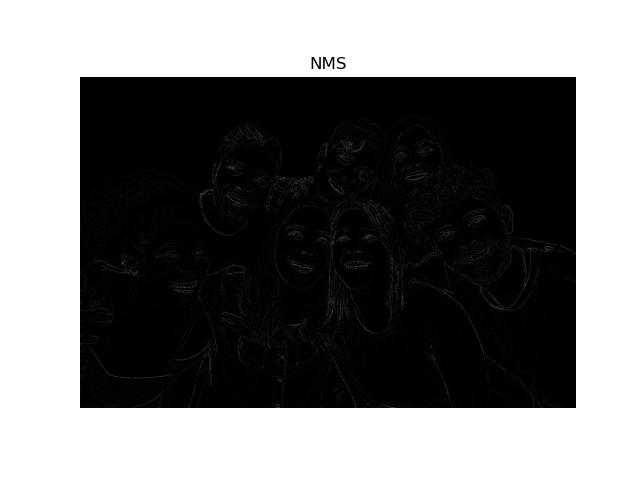
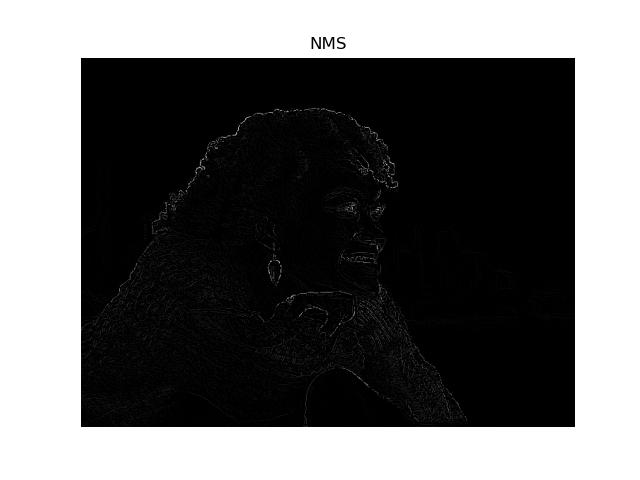

# Assignment 1 Report

## Image 1 Results

### Gaussian Smoothing

### X and Y Derivatives

### Gradient Magnitude

### NMS

### Hysteris Thresholding

---

## Image 2 Results

### Gaussian Smoothing

### X and Y Derivatives

### Gradient Magnitude

### NMS

### Hysteris Thresholding

---

## Image 3 Results

### Gaussian Smoothing

### X and Y Derivatives

### Gradient Magnitude

### NMS

### Hysteris Thresholding

---

## Image 4 Results

### Gaussian Smoothing

### X and Y Derivatives

### Gradient Magnitude

### NMS

### Hysteris Thresholding

---
## Image 5 Results

### Gaussian Smoothing

### X and Y Derivatives

### Gradient Magnitude

### NMS

### Hysteris Thresholding

